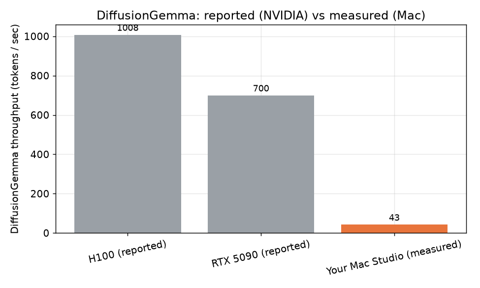
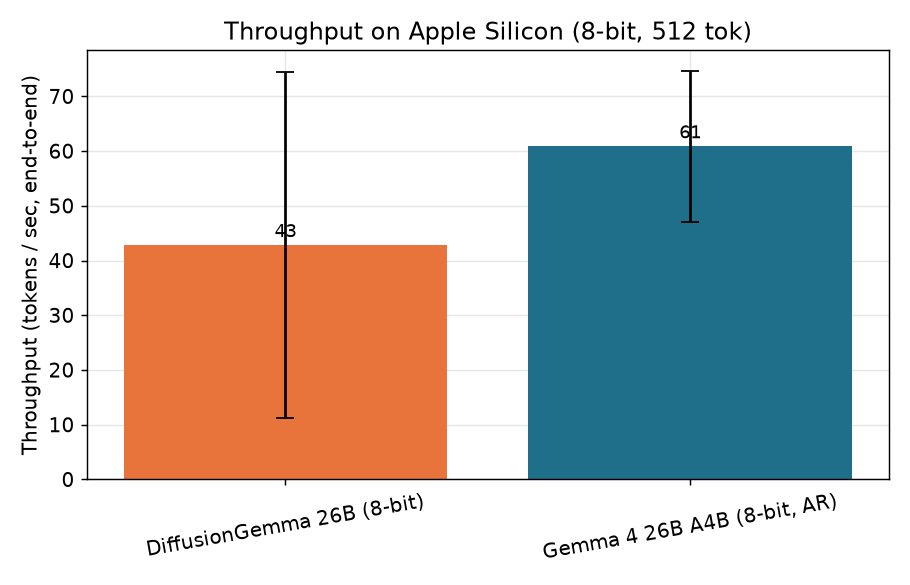
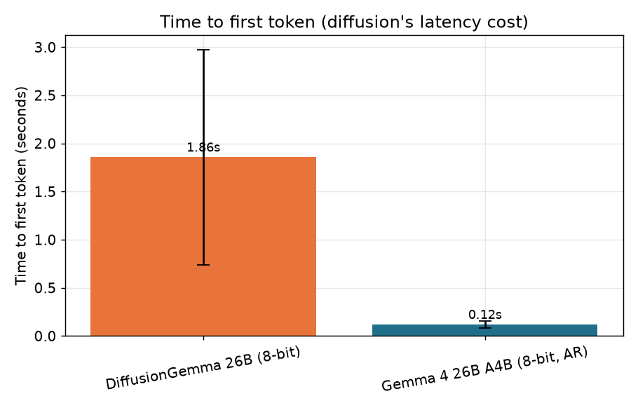
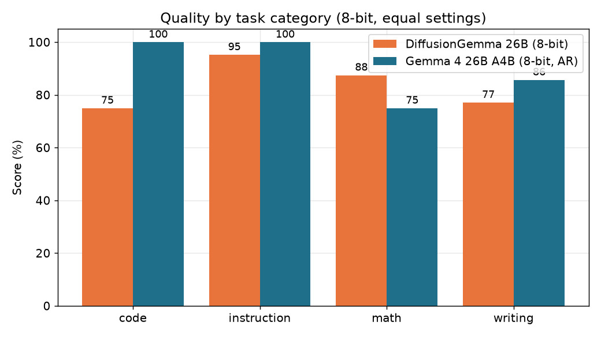

There's a number floating around that's hard to ignore.

Google's new DiffusionGemma is supposed to crank out **1,000-plus tokens per second**. For comparison, the local models most of us run putter along at 30 to 100. So a 10x jump? That gets my attention.

The reason it's fast is genuinely interesting. Every model you've used — ChatGPT, Claude, your local Llama — writes one token at a time, left to right, each word waiting on the one before it. That's "autoregressive." Diffusion models work completely differently. They start with a blank canvas of 256 tokens and refine the whole block at once, in parallel, like a photo developing. No waiting in line.

On paper, that's the future. So I did the obvious thing: I ran it on my Mac Studio to see if the future had arrived on my desk.

It hadn't. And the *way* it hadn't turned out to be more interesting than a win would've been.

## The fair fight

Here's the thing that makes this a clean test instead of a vibe check.

DiffusionGemma is built on the same bones as Gemma 4 — Google ships an autoregressive **Gemma 4 26B A4B** that's the same size, same architecture, same weights. The *only* difference is how it generates: diffusion vs. one-token-at-a-time.

So I put them head to head. Same Mac. Same 8-bit quantization. Same runner (Apple's MLX). Same prompts, same everything. The one variable left standing is the decoding paradigm itself. If diffusion is faster, this proves it. If it's not, there's nowhere to hide.

Thirty prompts across code, math, instruction-following, and writing. Five runs each. Let's look.

## The result nobody puts in the headline

DiffusionGemma did about **43 tokens per second** on my Mac.

The boring old autoregressive model did **61**.

The diffusion model — the one that does 1,000+ on a datacenter GPU — was the *slower* of the two on Apple Silicon. Not by a hair. By 40%.

That gap between the headline and my desk is about 23x. The 1,000 tok/s is real — it's just real on an H100, a $30,000 datacenter card. On a Mac, that number has nothing to do with your life.

And it gets worse for diffusion if you care about how snappy a chat feels. There's a metric called time-to-first-token — how long you stare at a blank screen before words start appearing. The autoregressive model started typing in **0.12 seconds**. DiffusionGemma took **1.86**.

That one surprised me until I thought about it. Remember how diffusion refines a whole 256-token block at once? That's the catch — it can't show you *anything* until the entire block is done cooking. The "parallel" model that's supposed to feel instant actually feels laggier, because it makes you wait for the batch.

## Why the magic doesn't travel

So why does the same model fly on an H100 and crawl on a Mac?

It comes down to what each machine is good at. Diffusion's whole speed trick is doing a giant pile of math all at once — refining 256 tokens in parallel. An H100 has thousands of cores sitting there begging for exactly that kind of bulk work. Flood it, and it's happy.

Apple Silicon doesn't win that way. It's not short on memory — my Mac Studio has 256GB — but it's limited by how fast it can move data around, not how much math it can do at once. The fancy parallel block doesn't help when the bottleneck is the plumbing, not the engine.

Autoregressive decoding, meanwhile, plays to the Mac's strengths. It reuses its previous work (a "KV cache") and touches way less memory per token. Same model, same weights — the architecture that wins in the datacenter loses on the laptop. The hardware decides.

## The benchmark that kept slowing itself down

I almost shipped wrong numbers. Here's the part the polished writeups leave out.

My first full run looked fine for the first 15 or so generations. Then DiffusionGemma started... degrading. Not crashing — *slowing*. Time-to-first-token climbed from 1 second to 2, then 4, then 18, then 60, and by the 28th generation a single response took over **two minutes**. Same prompt that was instant a minute earlier.

My first guess was a memory leak. So I checked. And this is the maddening part: every memory counter the framework reports stayed *flat*. By the numbers, nothing was wrong. I added the standard "clear the cache between runs" call. No change. I added a "wait for the GPU to finish" call. It nudged the cliff from generation 18 to generation 19 and then fell off it anyway.

The culprit turned out to be the graphics driver itself quietly piling up state that none of the normal tools could see or clear. The only thing that actually worked was brute force: run a handful of generations, then kill the whole process and start fresh. Let the operating system clean up what the framework couldn't.

Two lessons I'm keeping:

**Trust the measurement over the marketing — and over your own assumptions.** If I'd run 15 prompts and called it a day, I'd have published a number that looked great and was completely fake.

**Your tools can lie by omission.** "Memory usage is flat" is not the same as "nothing is accumulating." The dashboard being green doesn't mean the system is healthy.

## Quality: closer, but autoregressive still edges it

Speed isn't everything, so I scored the actual answers too. Code got run and tested. Math got checked against the right answer. Instruction-following got graded against rules. Writing got judged blind.

Overall, autoregressive Gemma came out ahead — 0.90 to 0.84 — winning code, instructions, and writing, while DiffusionGemma edged it on math. Honestly, that tracks with Google's own advice, which quietly tells you to use the standard model "for maximum quality." It's a real gap, but it's not a blowout.

So the diffusion model on my Mac was slower, laggier, *and* a notch lower quality. That's not a trade-off. That's just losing.

## So should you care?

If you run models locally on a Mac, here's the takeaway: **don't reach for DiffusionGemma expecting the headline.** You'll get a third of the speed of the autoregressive version, worse responsiveness, and slightly weaker answers. For Mac local inference, boring old next-token generation still wins.

That's not a knock on diffusion models. The approach is genuinely promising, and on the right hardware it's a rocket. But "the right hardware" is an NVIDIA datacenter card right now, not the machine on your desk.

The bigger lesson is the one I keep relearning: **a vendor benchmark is true and useless until you run it on your own hardware.** 1,000 tokens per second was a real number that told me nothing about my Mac. The only way to know what a tool does for *you* is to point it at *your* setup and watch.

I built the whole benchmark as a reusable harness — same-architecture comparison, real scoring, the works — so when MLX gets a diffusion-optimized path (or llama.cpp's Metal support lands), I can re-run it in an afternoon and see if the story's changed. I suspect it will, eventually. Just not today.

---

*Running local models on Apple Silicon and want the harness? It's on my GitHub. And if you want more of these "I actually tried it so you don't have to" breakdowns, subscribe — that's most of what I do here.*
