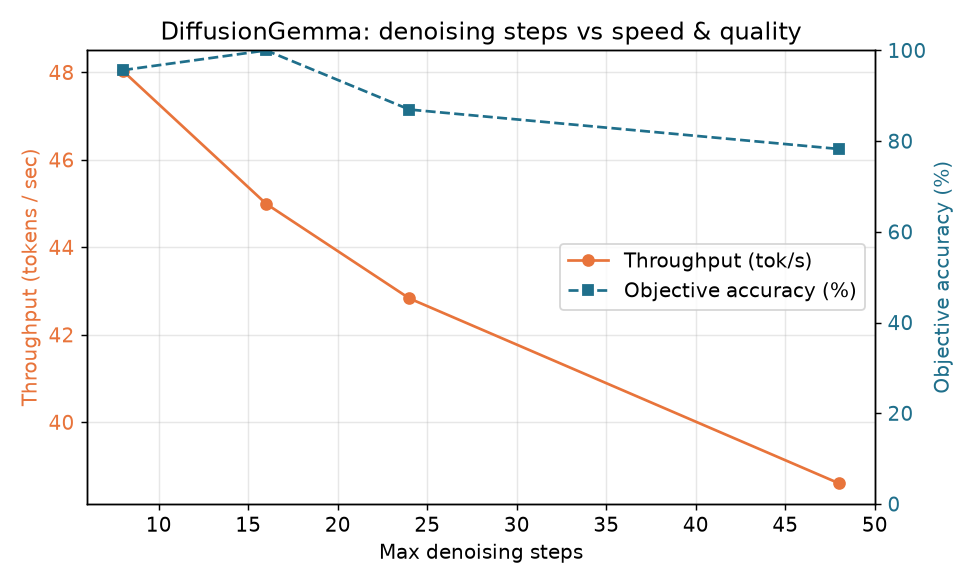

# Findings: DiffusionGemma vs Autoregressive Gemma 4 on Apple Silicon

*Run on a Mac Studio (Apple Silicon, 256 GB RAM), 2026-06-18. Both models at 8-bit
MLX, via `mlx-vlm` 0.6.3. 30 prompts × 5 timed trials each. Raw data:
`results/run-7/`, step sweep: `results/sweep-1/`.*

## TL;DR

**The "1,000+ tokens/sec" headline does not survive on Apple Silicon — and the
diffusion model is actually *slower* than the equivalent autoregressive model on
the same Mac.** DiffusionGemma managed **~43 tok/s**; the autoregressive Gemma 4
26B A4B (same architecture, same weights, just next-token instead of denoising)
did **~61 tok/s**. The diffusion speed revolution is real on NVIDIA datacenter
GPUs (~1,008 tok/s on an H100) and simply doesn't reach a Mac today.

The interesting part isn't that it's slower — it's *why*, and the fact that the
parallelism that makes diffusion fast on an H100 is exactly what Apple Silicon
can't exploit.

## Speed

| Model | Throughput (tok/s) | TTFT (s) | Peak memory |
|---|---|---|---|
| DiffusionGemma 26B (8-bit) | **42.8 ± 31.7** | **1.86 ± 1.12** | 30.6 GB |
| Gemma 4 26B A4B (8-bit, AR) | **60.9 ± 13.8** | **0.12 ± 0.04** | 28.0 GB |

Three things stand out:

1. **Autoregressive wins throughput by ~1.4×** on this hardware — the opposite of
   the datacenter result. 
2. **The reported-vs-measured gap is ~23×.** ~1,008 tok/s (H100) → ~43 tok/s
   (Mac Studio). 
3. **Time-to-first-token is ~15× worse for diffusion** (1.86s vs 0.12s). A
   diffusion model must denoise an entire 256-token block before it can emit
   anything, so despite "parallel" generation it feels *less* responsive in a
   chat UI, not more. 

Note also the **variance**: DiffusionGemma's throughput swings wildly
(±31.7 on a mean of 42.8 — a ~74% coefficient of variation) versus the AR
model's tight ±13.8 (~23%). Diffusion on Apple Silicon is not just slower, it's
far less predictable run-to-run. And this is *with* the entropy-bound sampler
early-stopping aggressively — it used a median of only ~8 of the allowed 48
denoising steps, so the model was already running near its fastest and still lost.

## Quality

Roughly comparable, with the autoregressive model slightly ahead overall — which
matches Google's own guidance to prefer standard Gemma "for maximum quality."

| Model | Overall | code | instruction | math | writing |
|---|---|---|---|---|---|
| DiffusionGemma 26B (8-bit) | 0.84 | 0.75 | 0.95 | 0.88 | 0.77 |
| Gemma 4 26B A4B (8-bit, AR) | **0.90** | **1.00** | **1.00** | 0.75 | **0.86** |

- **Code** (execution-scored) and **instruction-following** (deterministic checks)
  favor the AR model clearly.
- **Math** (numeric match) is the one category diffusion won (0.88 vs 0.75) — the
  AR model's verbose chain-of-thought occasionally ran past the token budget on
  the harder problems.
- **Writing** (blind Claude-CLI judge) slightly favors AR.

Quality scoring is objective for code/math/instruction (run the code, match the
number, check the format); only the 7 writing prompts use an LLM judge.

## The speed↔quality knob (denoising steps)

| max steps | throughput | objective accuracy | actual steps used |
|---|---|---|---|
| 8 | 48.0 tok/s | 95.7% | 4.7 |
| 16 | 45.0 tok/s | 100% | 5.3 |
| 24 | 42.8 tok/s | 87.0% | 5.3 |
| 48 | 38.6 tok/s | 78.3% | 5.7 |

Counterintuitively, raising the `max_denoising_steps` cap made it both **slower
and less accurate** on this set. The likely reason: the entropy-bound sampler
early-stops at ~5 steps regardless, so the cap mostly changes the *temperature
schedule* (which is parameterized by `cur_step / max_steps`) — a higher cap keeps
early steps at higher effective temperature, hurting determinism. Caveat: only 23
objective prompts, so treat the accuracy column as directional, not definitive.
The throughput trend (fewer steps = faster) is clean.

## Why the speed doesn't travel

Diffusion's throughput win on an H100 comes from denoising a 256-token block *in
parallel* — that floods a GPU's thousands of cores with work. Apple Silicon's GPU
has far fewer cores and is **memory-bandwidth-bound**, not compute-bound, so the
parallel block doesn't buy the same multiplier. Autoregressive decoding, which
reuses a KV cache and touches less memory per token, fits the Mac's strengths
better. Same model, same weights — the architecture that wins on a datacenter GPU
loses on a laptop-class one.

## Caveats (read before quoting these numbers)

- **One machine, one quantization (8-bit), one runner (mlx-vlm 0.6.3).** Numbers
  will shift with the chip, MLX version, and quant tier.
- **Determinism asymmetry:** the AR baseline runs at `temperature=0`; DiffusionGemma
  uses its entropy-bound schedule and can't be fully pinned, so its outputs (and
  timings) vary run-to-run. We report variance rather than hiding it.
- **Throughput is end-to-end** (output tokens ÷ wall time), measured identically
  for both. TTFT reported separately.
- **A real gotcha worth its own sidebar:** DiffusionGemma's throughput *collapses*
  if you run many generations in one process — TTFT climbed 1s → 124s after ~18
  generations (≈36 canvas blocks). MLX's own memory counters stayed flat the whole
  time; neither `mx.clear_cache()` nor `mx.synchronize()` prevented it. It's Metal
  driver-level state accumulation. The only reliable fix was running generations in
  short-lived subprocesses. If you benchmark this model yourself and see it "getting
  slower," that's why.

## Bottom line

If you're running locally on a Mac and reach for DiffusionGemma expecting the
1,000 tok/s headline, you'll be disappointed: you'll get ~43 tok/s, worse latency,
higher variance, and slightly lower quality than just running autoregressive
Gemma 4. The diffusion speed story is genuinely exciting — but as of mid-2026 it's
an **NVIDIA datacenter story**, not an Apple Silicon one. For Mac local inference,
autoregressive still wins.
